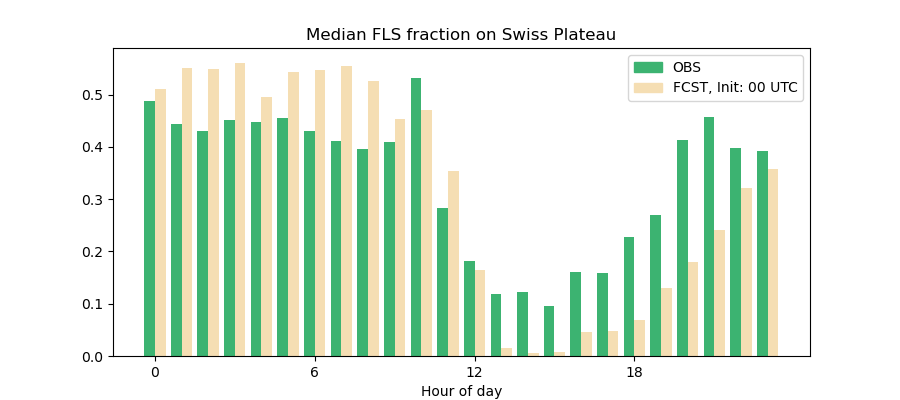

=============
fls_sat_verif
=============

=============================================================================================================================================================================================================
**NB: This repository is not maintained anymore, for FLS verification, use https://github.com/meteoSwiss-APN/spativeri**
=============================================================================================================================================================================================================

Satellite-based verification of fog and low stratus forecasts. For explanation of underlying ideas see the following two publications and a dedicated confluence page:
    - https://doi.org/10.1002/qj.3849 : Sections 3.1 and 5.1
    - https://doi.org/10.1029/2020MS002437 : Section 3.2
    - https://service.meteoswiss.ch/confluence/x/OpJGBg

------------
Installation
------------
1. Clone this repo
2. ``cd fls_sat_verif``
3. ``make venv install``

If you are a developer, you might want to install the package as an editable: ``make venv install-dev``

-----
Usage
-----

You might want to copy and modify the test script (see next section) which runs the verification according to the steps described below.

All work will happen in a dedicated working directory <wd>, e.g. ``$SCRATCH/wd_fls_sat_verif``.

To get detailed log-messages printed to screen use ``-v``, ``-vv`` or even ``-vvv``.

1. Prepare SAT input data: Retrieve with rubyscript
---------------------------------------------------

    1. Create directory ``<wd>/sat``

    2.  Run: ``rbrun ~osm/bin/extract_satdata.rb -P LSCL -m c1e -p <start>..<end>,1h -o <wd>/sat/ -v``

        - start: e.g. 202108302345
        - end: e.g. 202112312345
        - intervall: 1h, 3h
        ! The satellite files are available at :45 only!

    3. Manually check whether files are available, if many files are missing, get in contact with Uli Hamann & Daniel Leuenberger

2. Prepare COSMO input data: Retrieve from archive, extract TQC
---------------------------------------------------------------

    IMPORTANT! Expected model output format: ``<exp_dir>/FCST<YY>/YYMMDDHH_???/grib/c1effsurfHHH_000``. You might need to create a link for ``<exp_dir>/FCST<YY>`` depending on the structure of your data.

``conda activate fls_sat_verif``

``fls_sat_verif --retrieve_cosmo --wd <wd> --start <YYMMDDHH> --end <YYMMDDHH> --interval <HH> --exp_model_dir <exp_dir> --exp <experiment_identifier> --model c1e``

    ADVICE! If you evaluate a long period, cut it into chunks of 3-5 days and send parallel jobs on postproc nodes with ``sbatch`` or ``batchPP``.

3. Calculate FLS fractions
--------------------------

``fls_sat_verif --calc_fractions --wd <wd> --start <YYMMDDHH> --end <YYMMDDHH> --interval <HH> --max_lt <HH> --exp <experiment_name> --extend_previous --model c1e``

4. Plotting
-----------

``fls_sat_verif --plot_median_day_cycle --wd <wd> --start <YYMMDDHH> --end <YYMMDDHH> --init <H> --exp <experiment_name>``

``fls_sat_verif --plot_fraction_per_leadtime --wd <wd> --start <YYMMDDHH> --end <YYMMDDHH> --max_lt <LT> --init <H> --exp <experiment_name>``

----
Test
----
At the moment there is one test script included which tests the processing chain for a cosmo-2e experiment. If no "succesfull" is printed at the end, the test has failed. First activate your conda environment and then run:

``./tests/fls_sat_verif/test_fls_sat_verif.sh``

-------
Credits
-------

This package was created with `Cookiecutter`_ and the `MeteoSwiss-APN/mch-python-blueprint`_ project template.

.. _`Cookiecutter`: https://github.com/audreyr/cookiecutter
.. _`MeteoSwiss-APN/mch-python-blueprint`: https://github.com/MeteoSwiss-APN/mch-python-blueprint
